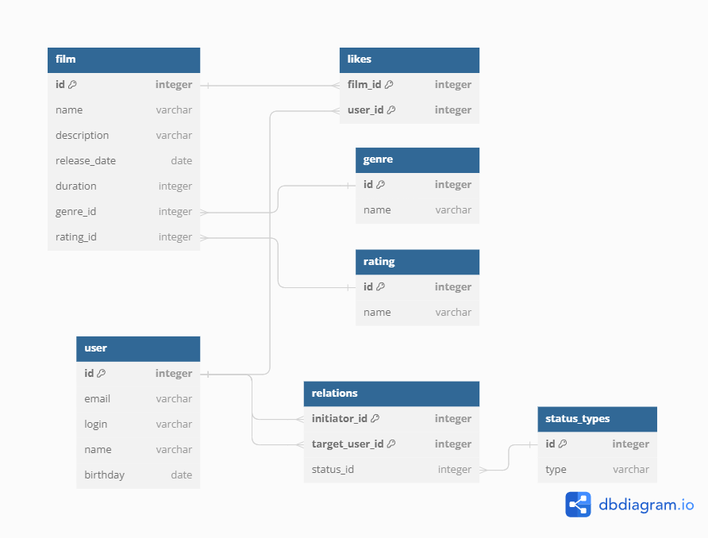

# java-filmorate
Template repository for Filmorate project.
# Схема базы данных


## Получение жанра фильма
```sql
SELECT film.name AS film_name, genre.name AS genre_name
FROM film
JOIN genre ON film.genre_id = genre.id;
```
## Получение всех друзей пользователя
```sql
SELECT user.id,
       user.name
FROM (
    SELECT target_user_id AS friend_id
    FROM relations r
    WHERE r.initiator_id = [USER_ID] AND status = 'confirmed'
    UNION
    SELECT initiator_id AS friend_id
    FROM relations r
    WHERE r.target_user_id = [USER_ID] AND status = 'confirmed') AS friends
JOIN user ON friends.friend_id = user.id;
```
## Получение всех фильмов и их рейтингов
```sql
SELECT film.name AS film_name, rating.name AS rating
FROM film
JOIN rating ON film.rating_id = rating.id;
```
## Получение всех пользователей, которым понравился определенный фильм
```sql
SELECT user.id,
       user.name
FROM user
JOIN likes ON user.id = likes.user_id
WHERE likes.film_id = [FILM_ID];
```


